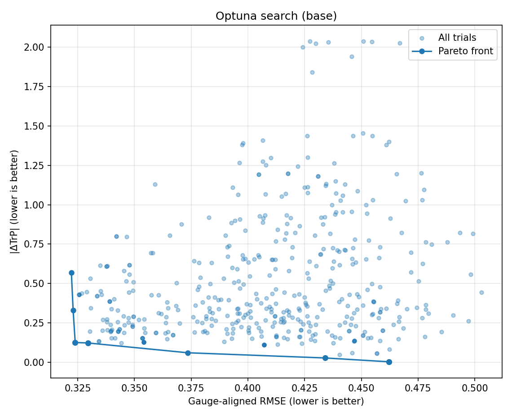
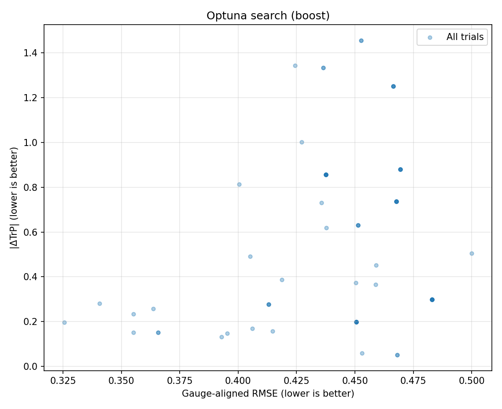

# LatticeBench — A Discrete Gauge Theory Playground (PoC)

**English / 日本語**

---

## 🧩 Overview | 概要

**English**  
**LatticeBench** is a **minimal proof-of-concept (PoC)** platform for experimenting with
**discrete space-time structures** using a **Physics-Informed Neural Network (PINN) on a 2D SU(2) lattice**.

In conventional lattice QCD, exploring new physical structures requires
heavy modification of large-scale HPC frameworks (e.g., QUDA, Chroma, openQCD)
and massive computational resources. This makes **testing new theoretical structures
or principles very difficult** for individuals.

LatticeBench aims to be a **lightweight numerical playground** where one can
**embed physical constraints (unitarity, gauge symmetry) into the network structure**,
and **learn to reproduce gauge-invariant observables (plaquette, Wilson loops, Creutz ratio)**.

Unlike typical PINNs (which approximate **continuous PDEs**),
LatticeBench attempts to explore **discrete space-time structures themselves** —
a direction rarely explored so far.

This is **not a validated physical model**, but intended as an **idea prototype** for those
interested in **structure-informed neural approaches to lattice gauge theory and beyond**.

---

**日本語**  
**LatticeBench** は、**時空が本質的に離散的かもしれない**という仮定のもとに、
**2次元 SU(2) 格子上での物理インフォームド NN（PINN）** を構築する
**最小限の概念実証（PoC）** 実装です。

従来の格子 QCD では、新しい物理構造を検証するには
QUDA・Chroma・openQCD などの **大規模 HPC コード** を改造する必要があり、
膨大な計算資源と専門知識を要するため、**個人が理論構造を柔軟に試すことは極めて困難**でした。

LatticeBench は、**物理的制約（ユニタリティ・ゲージ対称性）をネットワーク構造に組み込み**、
**プラークエットや Wilson ループ、クルーツ比といったゲージ不変量** を再現するように学習させることで、
**新しい理論構造を小規模に数値検証できる実験的プラットフォーム** を目指します。

これは、**連続場方程式の近似器として使われてきた PINN を**
**あえて離散的な時空構造そのものの探索に応用する** という、
これまでにほとんど例のない試みです。

**物理的妥当性は未検証** であり、
**構造制約付き NN を格子ゲージ理論に応用する着想を提供する** ことを目的としています。

---

## 🚧 Limitations & Future Work | 制約と今後の展望

- **Scope (PoC):** This repository favors **experimentability over validity**. No claim of physical correctness.
- **Small lattice / SU(2):** Default experiments use small periodic lattices with the **SU(2)** gauge group.
- **Model reuse & inference-only workflows:** *Not assumed* in the current PoC.  
  However, as lattice **dimensionality/complexity increases** (e.g., SU(3) or 3D/4D), saving and **reusing trained models** (for inference or as **warm starts / fine-tuning** bases) may become meaningful.

—

- **スコープ（PoC）:** 本リポジトリは **物理的な厳密性より実験容易性を重視** しています。
- **小規模格子 / SU(2):** 既定では **小さな周期格子**・**SU(2)** を前提にしています。
- **モデル再利用・推論専用:** 現段階では **前提としていません**。  
  ただし、**次元/複雑さの拡大**（例：SU(3) や 3D/4D）では、**学習済みモデルの保存・再利用**（推論や **ウォームスタート / 微調整**）の有効性が高まる可能性があります。

> Looking ahead, if we ever succeed in building a PINN structure that reproduces target observables with **sufficiently small loss**, such solutions may offer **hints toward better theoretical formulations**—even if they are still numeric surrogates rather than validated physical models.  
> 将来に向けて言えば、**損失が十分に小さい PINN 構造**を確立できた場合、厳密な物理モデルには至らなくても、**理論的枠組みへのヒント**を与える可能性があります。

---

## 🔎 Model Analysis & Interpretability | モデル解析と可解釈性

**English**  
To keep claims scientifically cautious while extracting insight from trained models, we propose the following **analysis protocol**. Each item is phrased to avoid over-claiming and focuses on verifiable properties on a 2D SU(2) lattice.

1. **Gauge-consistency checks (invariance/equivariance)**  
   - Verify that predictions of gauge-invariant quantities (plaquette/Wilson loops) are **unchanged under random local SU(2) gauge transforms** of inputs.  
   - Where alignment is used, report metrics both **before** and **after** gauge alignment to quantify reliance on alignment.

2. **Layer-wise constraint diagnostics**  
   - Monitor unitarity deviation per layer/output: `||U^† U - I||_F`.  
   - Track how much each loss term (plaquette, Wilson, Creutz, unitarity, smoothness) **contributes to total loss** at convergence.

3. **Sensitivity analysis (saliency/Jacobians)**  
   - Compute `∂L/∂U_{x,μ}` and aggregate by local motifs (links, plaquettes, rectangles) to see **which structures drive the loss**.  
   - Compare sensitivities across loss types (MSE vs Huber) to identify **robust vs brittle** contributions.

4. **Probing internal representations**  
   - Train **linear probes** from hidden features to reconstruct gauge-invariant observables (plaquette trace, Wilson loops not used by the loss).  
   - If simple probes succeed on **hold-out loop shapes/sizes** (excluded from loss), it suggests the network has learned **useful inductive structure** beyond targets.

5. **Ablation & constraint toggling**  
   - Retrain while removing or scaling individual loss terms; measure shifts in the **empirical Pareto front** (`GA-RMSE` vs `|ΔTrP|`).  
   - This isolates **which constraints are necessary/sufficient** for particular behaviors.

6. **Cross-seed stability & similarity**  
   - Train multiple seeds; report variance of metrics and **representation similarity** (e.g., CKA) to assess whether learned structure is **seed-robust** or accidental.

7. **Generalization beyond training targets (validation-only observables)**  
   - Evaluate **observables intentionally excluded from the loss** (e.g., larger Wilson loops).  
   - These serve as **validation-only metrics**: if reproduced well, they indicate the model has captured structure beyond direct fitting.

8. **Baseline comparisons (sanity checks)**  
   - Compare against simple baselines (random SU(2) fields, smoothed/random-phase fields) and, where available, **small-lattice Monte Carlo** or strong-coupling estimates for the same observables.  
   - Report effect sizes, not just p-values, to avoid overstating small differences on tiny lattices.

**Caveats.** Low loss on a tiny lattice **does not imply** a correct continuum theory or scaling behavior. Results may be **non-identifiable** up to gauge and other symmetries; always report the evaluation protocol (gauge treatment, validation-only observables, seeds).

---

**日本語**  
主張を慎重に保ちつつ学習済みモデルから示唆を得るため、以下の **解析プロトコル**を提案します。いずれも 2D SU(2) の小格子で検証可能な範囲に留めています。

1. **ゲージ整合性（不変性/等変性）チェック**  
   - 入力に **局所 SU(2) ゲージ変換**をランダム適用しても、プラークエットや Wilson ループなどの **ゲージ不変量の予測が不変**であるか確認。  
   - ゲージアラインメントを用いる場合は、**前後の指標**を併記して、整合の依存度を明示。

2. **層別の制約診断**  
   - 各層/出力でのユニタリティ逸脱 `||U^† U - I||_F` を監視。  
   - 収束時点で各損失項（プラークエット、Wilson、Creutz、ユニタリティ、スムース）の **寄与率**を分解。

3. **感度解析（サリエンシー/ヤコビアン）**  
   - `∂L/∂U_{x,μ}` を計算し、リンク/プラークエット/長方形などの **局所構造ごとに集約**して、損失を支配する構造を特定。  
   - MSE と Huber で感度の **頑健/脆弱な差**を比較。

4. **内部表現へのプロービング**  
   - 中間特徴から **線形プローブ**で、学習に直接使っていないゲージ不変量（例：未使用サイズの Wilson ループ）を再構成。  
   - **ホールドアウト形状/サイズ**で再現性が高ければ、ターゲット超えの **構造学習**の示唆。

5. **アブレーション（制約の切替）**  
   - 個別損失項の削除/スケーリングで再学習し、**経験的パレート前線**（`GA-RMSE` と `|ΔTrP|`）の移動を観察。  
   - どの制約が **必要/十分**かを切り分け。

6. **シード間安定性と表現類似**  
   - 複数シード学習で指標分散と **表現類似度**（例：CKA）を報告し、学習構造が偶然ではないかを評価。

7. **学習ターゲット外への一般化（検証専用観測量）**  
   - 一部の観測量（例：より大きな Wilson ループ）を **loss から除外**し、**検証専用の評価指標**として利用。  
   - 良好に再現できれば、単なる当てはめではなく **構造的理解の獲得**を示唆。

8. **ベースライン比較（健全性確認）**  
   - 簡易ベースライン（ランダム SU(2) 場、位相平滑化場など）や、可能なら **小規模格子のモンテカルロ**/強結合近似の同一観測量と比較。  
   - 小格子ゆえの偶然性を避けるため、p値だけでなく **効果量**も併記。

**注意.** 小さな格子での低損失は、連続極限やスケーリングの正しさを **保証しません**。結果はゲージ等の対称性により **同定不能**な場合があるため、評価手順（ゲージ処理、検証専用観測量、シード）を必ず明記してください。

---

## ⚙️ Features | 特徴
- SU(2) gauge group on **small periodic lattices** (default examples use 4×4).
- **Structure-aware** approach:
  - SU(2) exponential map for strict unitarity
  - Smoothness and L2 regularization on embeddings and algebra outputs
- **Loss components:**
  - Plaquette traces (complex MSE)
  - Wilson loops (1×1, 1×2, 2×2, 1×3, 2×3)
  - Creutz ratio χ(2,2)
  - Unitarity / smoothness penalties
- **Evaluation metrics:**
  - Gauge-aligned link RMSE
  - Mean plaquette trace error (|ΔTrP|)

---

## 📈 Evaluation | 評価指標
- `|ΔTr P|`: 平均プラークエット誤差
- `Wilson(Rx,Ry)`: 汎化確認（未使用サイズ含む）
- `Creutz χ(2,2)`: 面張力推定
- `Gauge-aligned RMSE`: ゲージ変換自由度を除いたリンク RMSE

---

## 📦 Requirements & Setup | 必要環境とセットアップ

Minimal requirements (CPU execution):

```text
numpy
torch
pandas
matplotlib
optuna
```

> Note: `requirements.txt` deliberately excludes GPU‑specific builds of PyTorch.  
> 事前に環境に合った PyTorch をインストールしてから `pip install -r requirements.txt` を推奨します。

### GPU / CUDA (optional but recommended) | GPU / CUDA（推奨）

Install PyTorch with CUDA support **before** installing `requirements.txt`.
Check the official PyTorch site for the correct build for your system.

**Linux / Windows (CUDA 12.1 example)**

```bash
pip install --index-url https://download.pytorch.org/whl/cu121 torch torchvision
pip install -r requirements.txt
```

**CPU only**

```bash
pip install torch torchvision   # CPU build
pip install -r requirements.txt
```

**Apple Silicon (MPS)**

```bash
pip install torch torchvision   # MPS build
pip install -r requirements.txt
```

**Quick check**

```bash
python - <<'PY'
import torch
print("cuda? ", torch.cuda.is_available())
if torch.cuda.is_available():
    print("gpu  : ", torch.cuda.get_device_name(0))
print("mps?  ", getattr(torch.backends, 'mps', None) and torch.backends.mps.is_available())
PY
```

---

## 🚀 Usage | 使い方

**Train once / 単発学習**

```bash
python -m src.train \
  --epochs 700 --print_every 100 \
  --lr 5e-3 --seed 777 \
  --use_huber --huber_delta_wil 0.003 --huber_delta_cr 0.008 \
  --w_wil11 0.10 --w_wil12 0.56 --w_wil22 0.28 --w_wil13 0.20 --w_wil23 0.16 \
  --w_cr 0.55 \
  --w_plaq 0.04 \
  --w_unitary 0.06 \
  --w_phi_smooth 0.04 --w_theta_smooth 0.02 --w_phi_l2 0.002
```

Outputs are written to `runs/*.log` (if you tee logs yourself).

---

## 🧪 Batch Sweep (run.bash) | 一括スイープ

**English**  
`run.bash` launches a grid search over several loss weights, learning rates, Huber on/off, and seeds.
Each run writes a human-readable log to `runs/*.log`. It can take many hours on CPU.

**日本語**  
`run.bash` は複数の損失重み・学習率・Huber 有無・シードのグリッド探索を実行します。
各実行のログは `runs/*.log` に保存されます。CPU では長時間（数時間〜）かかります。

**Run**

```bash
bash run.bash
# logs -> runs/A_*.log, runs/B_*.log
```

**Notes | 注意**  
- Edit arrays in the header of `run.bash` to adjust the sweep.  
  （スクリプト先頭の配列を編集して探索範囲を調整できます）
- `runs/` is `.gitignore`-ed.  
  （`runs/` は `.gitignore` 済み）

---

## 🔍 Hyperparameter Search with Optuna | Optunaによる探索

**English**  
We provide an **Optuna-based search script** (`src/optuna_search.py`) for flexible tuning.  
It explores the **Pareto front** between `GA-RMSE` and `|ΔTrP|`.

**日本語**  
柔軟なハイパラ探索のために **Optuna スクリプト**（`src/optuna_search.py`）を用意しています。  
`GA-RMSE` と `|ΔTrP|` の **パレートフロント**探索に有効です。

**Basic run**

```bash
python -m src.optuna_search --trials 200 --epochs 500
```

Key options (subset) / 主要オプション（抜粋）:
- `--lr` (fixed) or `--lr_min --lr_max [--lr_log]`
- `--w_plaq`, `--w_wil{11,12,22,13,23}`, `--w_cr`, regularizers, and Huber deltas can be fixed or ranged via `*_min/*_max`.
- `--search_use_huber True False` to explore {True, False}.

Artifacts (single run) / 生成物（単発実行時）:
- `all_trials.csv`, `pareto_trials.csv`
- `pareto_scatter.png`
- `topk_by_ga_rmse.json`, `topk_by_abs_dTrP.json`

### two-phase search | 2 段階探索

**English**  
`run_optuna.bash` provides a ready-to-run wrapper around `src/optuna_search.py`.  
It performs a **two-phase search (Wide → Boost)** over hyperparameters on a 4×4 SU(2) lattice.  
Artifacts (CSV/JSON/plots/decision) are written under `runs/optuna/<timestamp>__latticebench-once__.../`.

**日本語**  
`run_optuna.bash` は `src/optuna_search.py` を呼び出す実行用ラッパースクリプトです。  
SU(2) 4×4 格子に対して **2 段階探索（Wide → Boost）** を行い、成果物（CSV/JSON/図・判定結果）を  
`runs/optuna/<timestamp>__latticebench-once__.../` に出力します。

**Run**

```bash
bash run_optuna.bash
# logs -> runs/optuna/run_*.log
# artifacts -> runs/optuna/2025xxxx-xxxxxx__latticebench-once__tr480__ep300__b1200/
```

**Notes | 注意**  
- Default setting: 480 trials (Wide, 300 epochs each) → top 15% boosted to 1200 epochs.
  （既定では Wide 480 試行・300エポック → 上位15%を Boost で1200エポックに延長）
- Results include:
  - `all_trials_base.csv`, `all_trials_boost.csv`
  - `pareto_scatter_base.png`, `pareto_scatter_boost.png`
  - `topk_by_ga_rmse_*.json`, `topk_by_abs_dTrP_*.json`
  - `decision.json` + `_ACCEPT`/`_REJECT` marker
- Like `run.bash`, the `runs/` directory is .gitignore-ed.
   （`run.bash` 同様、`runs/` は `.gitignore` 済み）

---

## 🧾 Log Analysis & Plots | ログ解析と可視化

**English**  
- `src/analyze_log.py`: parse one training log → **single-row CSV**  
- `src/audit_runs.py`: aggregate multiple logs → **CSV**  
- `src/plot_runs.py`: render Pareto scatter & histograms

**日本語**  
- `src/analyze_log.py`: 単一ログを解析して **1 行 CSV** 出力  
- `src/audit_runs.py`: 複数ログを **集計 CSV** に変換  
- `src/plot_runs.py`: パレート散布図やヒストグラムを描画

Examples / 例:

```bash
# 1) Aggregate many logs
python -m src.audit_runs runs/*.log --out runs_all.csv --top 20

# 2) Plot summaries
python -m src.plot_runs runs_all.csv --outdir plots --top 20

# (Optional) Visualize single-run CSV from analyze_log.py
python -m src.plot_runs runs.csv --outdir plots_runs --top 30
```

Artifacts / 生成物:
- `runs_all.csv` — one row per log/run  
- `plots/` — scatter/pareto & histograms; top-k CSV by `ga_rmse` and by `|Δ avgTrP|`

---

## 📊 Results of Hyperparameter Search | ハイパラ探索の結果

**English**  

The following results are as of September 25, 2025.

We executed `run_optuna.bash` on a 4×4 SU(2) lattice, using a two-phase Optuna search (Base → Boost).  
As shown in the Pareto scatter plots below (Base vs. Boost), the **Gauge-aligned RMSE** improved in the Boost phase.  
However, the **trade-off with the mean plaquette error** remained evident, and the Pareto front did not advance significantly.  

  

  

From these results, it appears that with the **current loss design and model structure**,  
further substantial improvement of the Pareto front is unlikely.  
Future progress may require **redesigning the loss function** (e.g., dynamic weighting, new regularizers) or **revamping the model architecture** (e.g., explicitly gauge-equivariant networks).

All artifacts are stored under:  
`runs/optuna/20250924-131205__latticebench-once__tr480__ep300__b1200/`

At present, while the **mean plaquette error remains difficult to reduce**,  
the **gauge-aligned RMSE is already sufficiently low**.  
However, these solutions are likely **numerical optima specialized to the small 4×4 lattice**,  
and there is **no guarantee that they extrapolate to larger lattices or the continuum limit**.  
Further verification will require the kinds of analyses described in  
**"Model Analysis & Interpretability"**.

---

**日本語**  

以下は 2025/9/25 時点での検討結果です。

`run_optuna.bash` を実行し、SU(2) 4×4 格子で Optuna による 2 段階探索（Base → Boost）を行いました。  
下図のパレート散布図（Base と Boost）に示すように、**Gauge-aligned RMSE の改善**は Boost 段階で確認できましたが、  
一方で **平均プラークエット誤差とのトレードオフ**は依然として残り、パレートフロントの大きな前進は見られませんでした。  

  

  

この結果から、**現状の loss 設計やモデル構造ではパレートフロントの大幅な改善は見込めない**ことが分かりました。  
今後の改善には、**loss の再設計**（動的重み付け、新しい正則化項など）や、**モデル構造の刷新**（ゲージ対称性を組み込んだネットワークなど）が必要になると考えられます。  

成果物は以下に格納されています：  
`runs/optuna/20250924-131205__latticebench-once__tr480__ep300__b1200/`

現時点のモデルは、**平均プラークエット誤差が下がりきらない**一方、 **Gauge-aligned RMSE は十分に低くなっています**。
ただしこの点についても、得られた解は **「小さな 4×4 格子」に特化した数値的最適解**である可能性が高く、  
そのまま **より大きな格子や連続極限に外挿できる保証はありません**。  
詳細な確認のためには「モデル解析と可解釈性」で示したような分析が必要になります。

---

## 💬 Motivation | 動機

**English**  
- Traditional lattice QCD research has mainly emphasized precise numerical verification of known theories, with large HPC-oriented codes.
- To the best of my knowledge, there is currently no lightweight, open platform dedicated to exploring new discrete structures or NN-based inductive biases.
- LatticeBench aims to serve as a seed platform for such exploratory work.

**日本語**  
- 従来の格子 QCD 研究は、主に 既知の理論の数値的な精密検証 に焦点が置かれ、大規模な HPC コードが用いられてきました。
- 私の把握する限りでは、新しい離散構造や NN ベースの帰納的バイアスを試す軽量オープン基盤 は存在していません。
- LatticeBench はそのような探索のための シードプラットフォーム を目指しています。

---

## 📝 Note | 注記

**English**  
I myself studied lattice QCD about 20 years ago at university.
This code was originally generated while chatting with ChatGPT about old memories,
but I decided to publish it here just in case it may be useful.

**日本語**  
私は 20 年ほど前に大学で格子 QCD を研究していました。
このコードは、ChatGPT とのたわいない思い出話の中で生成されたものですが、
念のため公開しておきます。

---

## 📜 License | ライセンス
MIT
